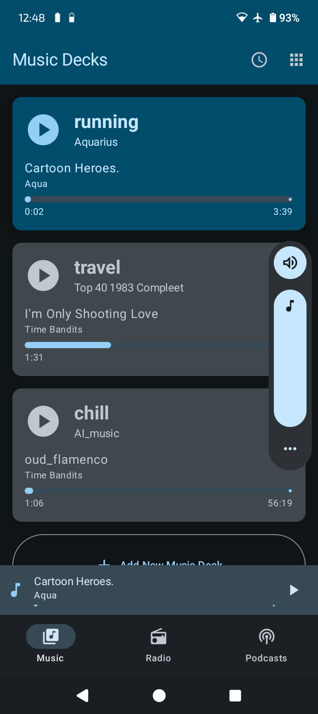
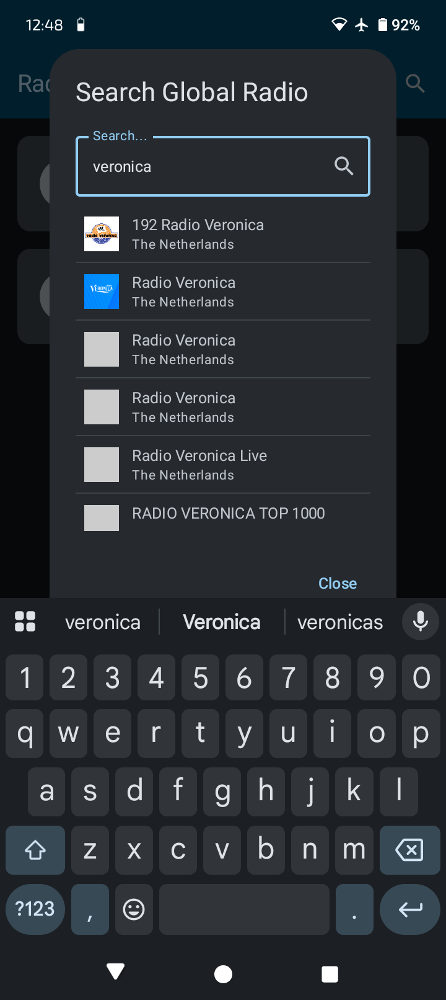
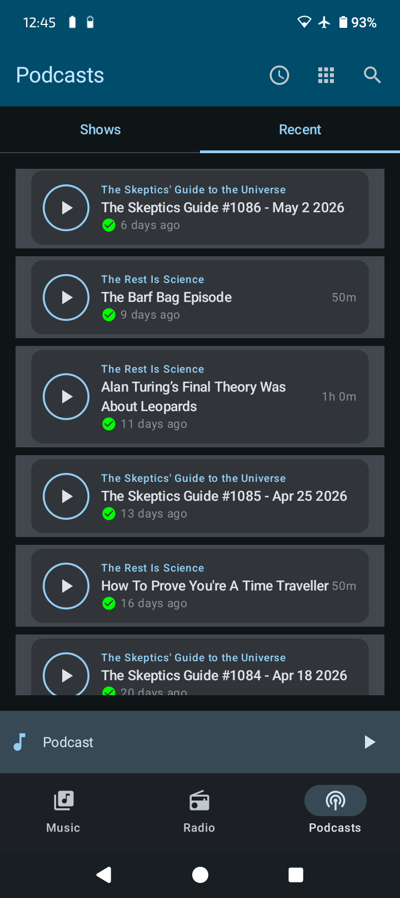

# KISS Audio: The simple music, radio and podcasts player

A dedicated, open-source center for your **Music, Radio, and Podcasts.** Built on the **KISS Principle** (Keep It Simple, Stupid) for users who value focus, privacy, and local control.

## 📥 [Download Latest APK](https://github.com/Hoogkamer/KISS_audio/releases)

---

## 📸 Screenshots

  
  &nbsp;&nbsp;
  
  &nbsp;&nbsp;
  

---

### 🛡️ The "Why": Reclaiming Your Audio Experience

**KISS Audio** is a breath of fresh air. It's a tool, not a platform. It doesn't track you, it doesn't show ads, and it treats your device like the high-quality audio equipment it is. If you want focus, privacy, and control, KISS Audio is for you.

### 📻 The "What": Three Worlds, One Hub

- **Music Decks**: Forget complex library management. Just create one or more **Decks** and select a folder. Each Deck remembers its own position independently—perfect for switching between your "Driving" playlist, a "Deep Work" folder, or your favorite DJ sets. This works 100% offline.
- **Global Radio**: Search and stream thousands of stations worldwide with zero tracking and real-time metadata.
- **Pure Podcasts**: Subscribe via RSS or use the built-in **Podcast Search** to discover new shows. Download for offline listening or stream directly.

### 🧠 Features Built for Focus

- **The "Tonmeister" Interface**: Inspired by Dieter Rams and classic Braun audio equipment, the UI is a strict, highly-functional grid. It features precision "Tuner Needle" progress bars, monospace data readouts, and a single, signature orange Play button. All audio types (Music, Radio, Podcasts) share this unified, distraction-free player.
- **Context Persistence**: KISS Audio remembers exactly where you were in every Deck, Station, or Episode. Switch in one tap and never lose your spot.
- **Dual-Mode Operation**:
  - **App Mode**: Use it as a lightweight, lightning-fast audio player.
  - **Launcher Mode**: Set it as your device's home screen (`CATEGORY_HOME`) to turn an old phone or tablet into a dedicated audio station.
- **Delightful Experience**:
  - **Simple & Focused**: Retro simplicity meets modern performance—minimal features, maximum focus.
  - **Secure & Private**: No analytics. No telemetry. Minimal permissions.
  - **100% Free**: No subscriptions. No "Premium" features. Open Source.

## 🛠️ Tech Stack

- **Kotlin & Jetpack Compose**: Modern, reactive UI.
- **Media3 (ExoPlayer)**: High-performance background playback.
- **Room & WorkManager**: Robust persistence and reliable background downloads.

## 📖 Documentation

- **[User Manual](user_manual.md)**: How to get the most out of KISS Audio.
- **[Technical Architecture](architecture.md)**: Deep dive into the state management and engine.
- **[Definition of Done](DOD.md)**: Project quality and release standards.
- **[Privacy Policy](privacy_policy.md)**: Our commitment to your privacy.

## 📲 Installation

> **Requires Android 14+ (API 34)**

1.  Go to the **[Releases](https://github.com/Hoogkamer/KISS_audio/releases)** page.
2.  Download the latest `.apk`.
3.  Open on your Android device to install (enable "Unknown Sources" if prompted).

## 📄 License

This project is licensed under the **MIT License** — see the [LICENSE](LICENSE) file for details.

---

_Built with ❤️ for the open-source community._
